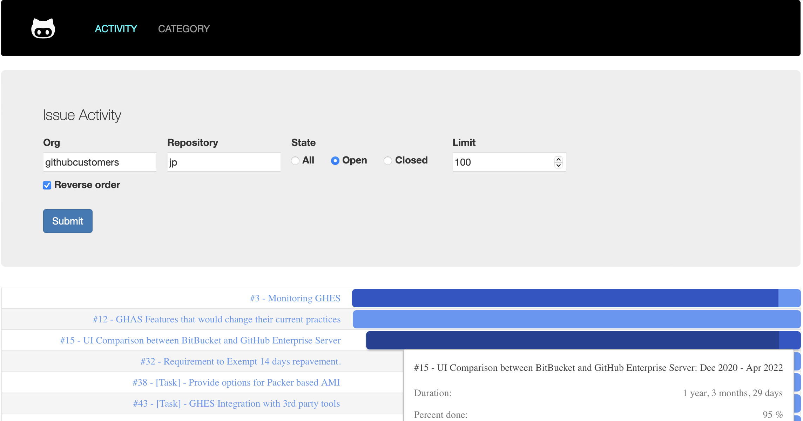

# Issue-Patrol

Observe and inspect Repository issues.

This App visualizes Issues, their age and activity, based on last update.

The goal is to get a quick overview on the status of Repo Issues.



Explanation:
- Issue 11 & 12 have been created in Dec '21 but received no updates
- Issue 10 & 13 have been created in Dec '21 and received their last update in Dec '21, no update on the Issues since

---

## Run the App

1. Create an `.env` file
   1. Copy the `.env.sample` file to `.env`, provide a GitHub PAT for the `TOKEN`

   Sample `.env` content

   ```bash
   API_URL=api.github.com
   PORT=8008
   TOKEN="ghp_..."
   ```

2. Start the App

    ```bash
    npm start
    ```
